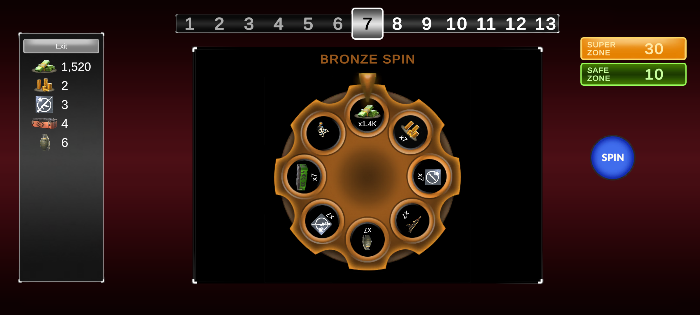
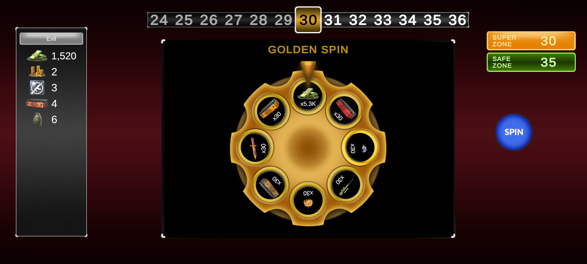
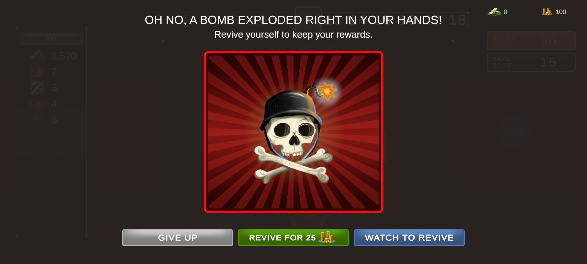
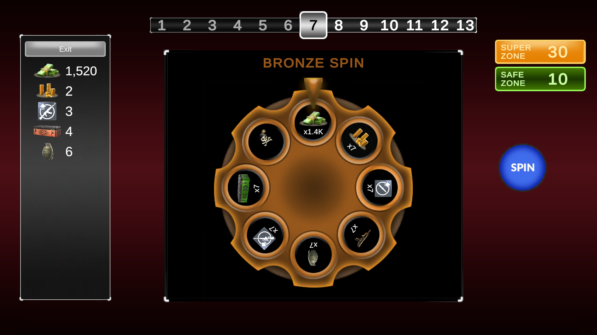
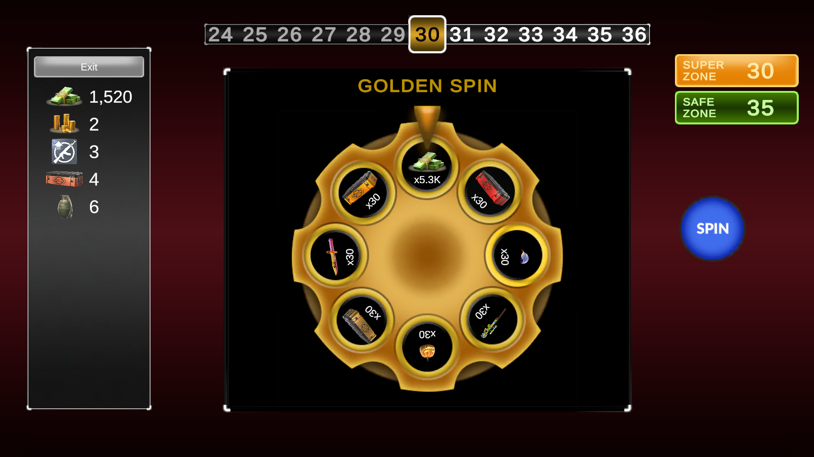
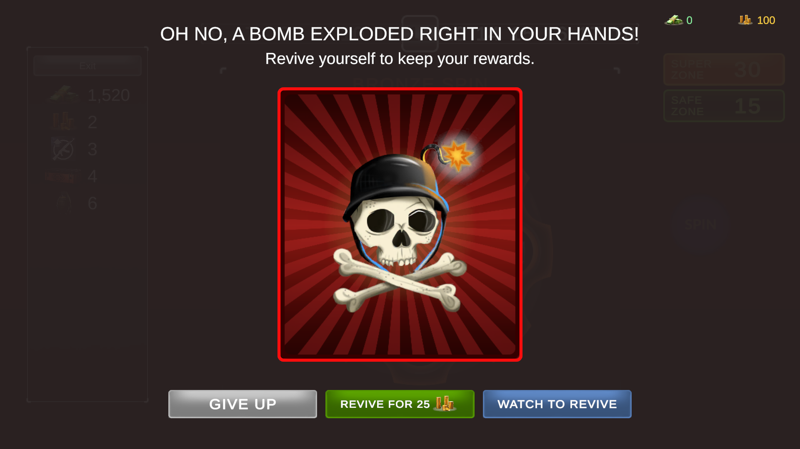
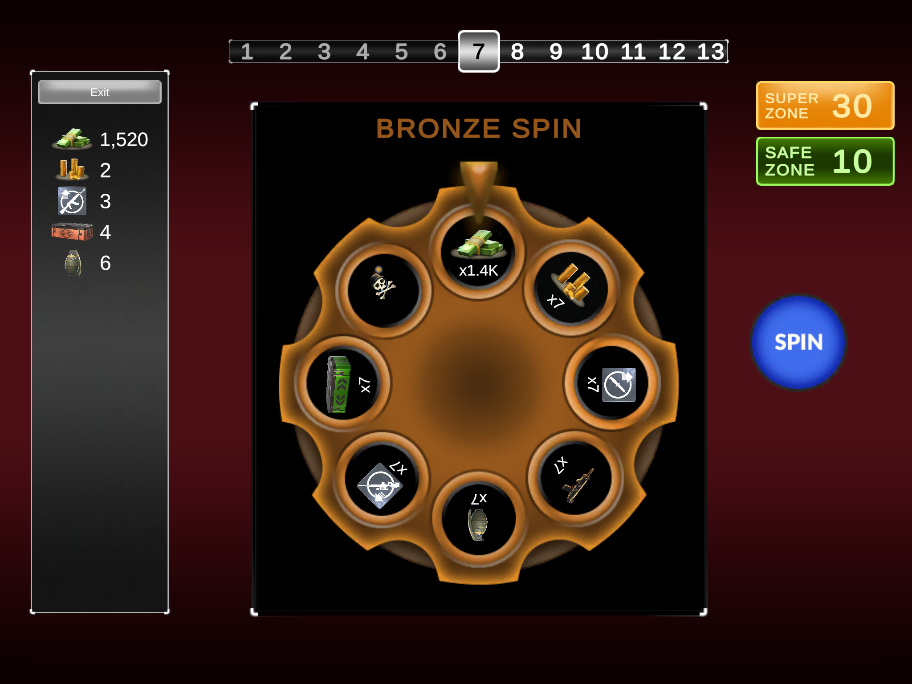
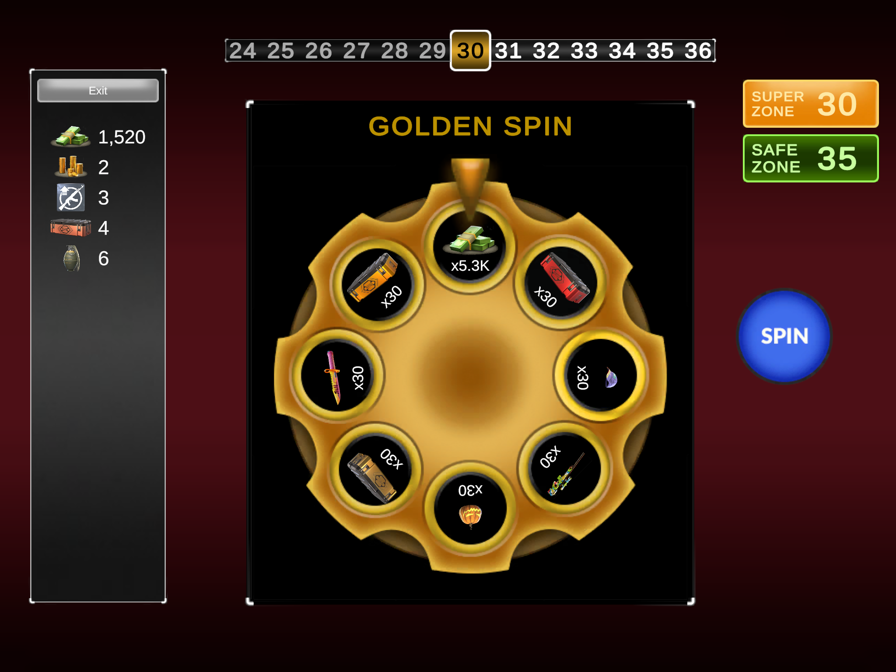
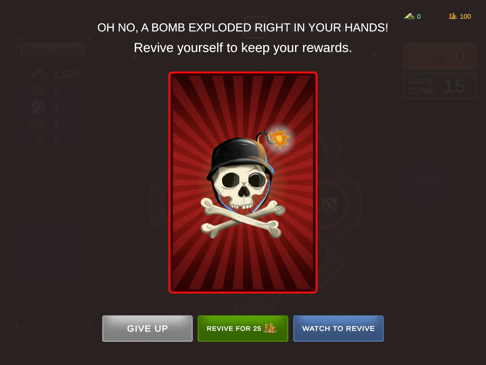

# Wheel of Fortune — Vertigo Games Case Study

A spin-the-wheel risk game for Android, made in Unity 2021.3 LTS. Each spin gives a reward and moves you to the next zone, unless it hits the bomb and you lose everything collected in the run.

**Download:** [latest APK](https://github.com/sametceltr/VertigoCardGame/releases/latest)

| | Normal zone | Super zone | Bomb |
|---|---|---|---|
| **20:9** |  |  |  |
| **16:9** |  |  |  |
| **4:3** |  |  |  |

## Rules

- Every 5th zone is a **safe zone** (silver spin, no bomb) and every 30th a **super zone** (golden spin, special rewards, no bomb).
- After a bomb you can revive with gold (cost rises each time), watch an ad once per session, or give up.
- You can leave whenever the wheel isn't spinning, but you only keep your rewards on a safe or super zone.

## Architecture

- **`GameBootstrap`** creates and connects everything and injects dependencies through constructors.
- **`GameRun`** is a plain C# state machine that owns the run. `WheelBuilder`, `SpinResolver`, `AmountCalculator`, `Wallet`, `CollectedRewards` and `ReviveOptions` each handle one part of it.
- **Views** subscribe to `GameRun` events and call its commands; they never change game state themselves.
- **`IRandom`** and **`IAdService`** keep the random source and the ad provider replaceable.

All tuning lives in ScriptableObjects under `Assets/CardGame/Data` (zones, wheels, rewards, rules, visuals), and each asset validates its values in the editor.

## Design choices

- **Leaving:** allowed on any zone, but rewards are only kept on safe and super zones.
- **Sliced sprites:** panels, frames and buttons are 9-sliced; pictures (reward icons, bomb art) use Preserve Aspect instead, since slicing would distort them.
- **Sprite atlas:** all UI sprites share one atlas page, except the large bomb flash, which would need a page of its own.
- **Zone panels:** the super and safe zone panels show the current zone while you're on it.
- **Revives:** gold revives get more expensive each time; the ad revive can be used once per session.

## Notes

- The UI uses Canvas Scaler **Expand** and TextMeshPro, and buttons are wired in code from `OnValidate`.
- Landscape only. Open `Assets/CardGame/Scenes/CardGame.unity` to run it in the editor.
